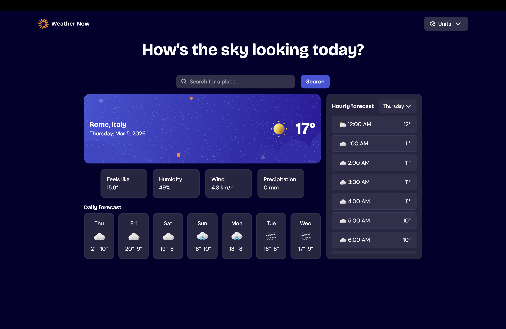
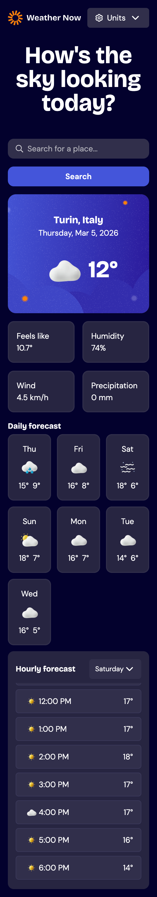

# 🌤 Weather App

A modern Weather Forecast Web App built with **Next.js** that allows users to search for cities and view current weather conditions, daily forecasts, and hourly predictions.

The application uses the **Open-Meteo API** for weather data and the **Open-Meteo Geocoding API** to provide real-time city suggestions while typing.


 [live demo](weather-app-xi-bay-53.vercel.app)

## Features

- City search with autocomplete
- Debounced API requests to optimize performance
- Multiple location suggestions for ambiguous city names
- Current weather conditions:
  - Temperature
  - Feels like
  - Humidity
  - Wind speed
  - Precipitation
- Daily forecast
- Hourly forecast
- Metric / Imperial unit switching:
  - Celsius / Fahrenheit
  - km/h / mph
  - mm / inches
- Duplicate location filtering
- Error handling for invalid searches
- Responsive layout


## What I Focused On

This project was built to practice and demonstrate:

- Next.js App Router architecture
- Server API routes
- Debounced search with React
- Clean component separation
- Global state management with React Context
- Reusable utility functions
- API data transformation


## Tech Stack

| Tool | Purpose |
|------|---------|
| Next.js 14 | Framework |
| React | UI library |
| TypeScript | Type safety |
| Tailwind CSS | Styling |
| Open-Meteo API | Weather data |
| Open-Meteo Geocoding API | City search |
| Vercel | Deployment |
| Lucide React | Icons |


## Project Structure

```
app
 ├─ api
 │   ├─ search
 │   │   └─ route.ts
 │   └─ weather
 │       └─ route.ts
 │
 ├─ components
 │   ├─ Header.tsx
 │   ├─ Search.tsx
 │   ├─ CurrentWeather.tsx
 │   ├─ Daily.tsx
 │   └─ Hourly.tsx
 │
 ├─ context
 │   └─ unitContext.tsx
 │
 ├─ utils
 │   ├─ weatherCodeMap.ts
 │   └─ dateFormatter.ts
 │
 └─ page.tsx
```


## How It Works

### 1. City Search

When the user types in the search bar, the input is debounced and a request is sent to:

```
GET /api/search?city={query}
```

This endpoint calls the Open-Meteo Geocoding API and returns possible locations.

### 2. Selecting a City

When a user selects a city, the app fetches:

```
GET /api/weather?lat={latitude}&lon={longitude}
```

This returns:
- Current weather
- Daily forecast
- Hourly forecast

### 3. Unit System

The app supports **Metric** and **Imperial** units. A React Context stores the selected unit and updates all components automatically.


## Installation

Clone the repository:

```bash
git clone https://github.com/alepacc/weather-app.git
```

Navigate into the project folder:

```bash
cd weather-app
```

Install dependencies:

```bash
npm install
```

Run the development server:

```bash
npm run dev
```

Open your browser at:

```
http://localhost:3000
```


## APIs Used

- **[Open-Meteo Weather API](https://open-meteo.com/)** — Weather forecast data
- **Open-Meteo Geocoding API** — City search and location coordinates


## Screenshots


